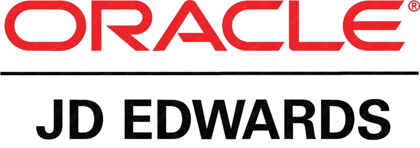

# JD Edwards EnterpriseOne : AI Add-On 

  

## 1. Enterprise Challenges (Real, Commonly Reported)

- **Z-table/batch upload validation** - Z-table interfaces and table conversions catch structural errors but not business-context issues in AAI (Automatic Accounting Instruction) mappings or supplier data.
- **AP exception handling** - Duplicate and near-duplicate voucher submissions create manual matching work across business units.
- **Supplier onboarding document intake** - Vendor forms and compliance documents typically require manual entry into address book and supplier records.
- **Orchestrator/AIS integration monitoring** - Failed Orchestrations or AIS Server calls require active monitoring, particularly in hybrid on-prem/cloud deployments.
- **Address book and AAI data quality** - Inconsistent address book entries and AAI setup persist in long-running EnterpriseOne environments.
- **Functional knowledge gaps** - Many JDE instances run heavily customized business functions and UBEs where institutional knowledge is concentrated in a small team.

## 2. Native Limitations (Why the Gap Exists)

JD Edwards EnterpriseOne provides a robust, mature integration foundation - Z-tables, Business Functions, the Orchestrator Studio, and the AIS (Application Interface Services) Server for REST-based access. However:

- **Z-table interfaces validate structure and required fields, not business-context accuracy** - a batch upload can pass table conversion and still contain an incorrect AAI or GL account mapping.
- **Base voucher matching in Accounts Payable is largely exact-match**, and doesn't reliably catch near-duplicates from resubmitted or reformatted vouchers.
- **Document intelligence for unstructured vendor documents isn't a core EnterpriseOne capability** - organizations typically rely on manual entry or third-party imaging add-ons.
- **In-app functional guidance is limited**, particularly in instances with significant custom Business Functions and UBEs that diverge from base JDE documentation.

These reflect JD Edwards's architecture as a highly configurable, long-lived platform - Orchestrator and AIS Server are the intended modern extension surface, deliberately separated from custom C Business Functions to preserve ESU/update compatibility.

## 3. Why Organizations Still Struggle

Many EnterpriseOne instances have decades of custom Business Functions and UBEs layered on top of the base application. Adding new intelligence directly into that layer increases ESU (Electronic Software Update) risk, so most organizations default to manual review rather than deepen the customization footprint.

## 4. How the AI Add-On Complements JD Edwards EnterpriseOne (Non-Invasive by Design)

| Challenge | AI Add-On | Integration Method |
|---|---|---|
| Z-table/batch upload validation | Intelligent Data Migration Validation Agent | Orchestrator/AIS reads pre- and post-load; zero core changes |
| Duplicate/exception vouchers | Semantic Duplicate Invoice Detection | Reads via AIS Server REST APIs on AP data |
| Vendor document intake | Vendor Invoice Intelligence + AI OCR Engine | File-based/API integration, no custom Business Function changes |
| Address book/AAI data quality | Financial Data Quality Agent | Batch validation via Orchestrator/AIS |
| Functional support | AI Knowledge Assistant | External service, no C Business Function dependency |
| Orchestration/interface monitoring | ERP Integration AI Gateway | Monitors Orchestrator/AIS endpoints externally |

All components integrate through JDE's standard Orchestrator Studio and AIS Server REST APIs - no custom C Business Functions or core UBE modification, fully compatible with ESU application cycles.

---

## 5. LinkedIn Content - Six Versions

### A. Short LinkedIn Post (250 words)

Anyone supporting a mature JD Edwards EnterpriseOne environment knows the pattern: Z-table uploads that pass table conversion but still need AAI cleanup, AP exception queues full of near-duplicate vouchers, and vendor documents that need manual entry into the address book.

This isn't a shortcoming in JDE's design. The Orchestrator Studio and AIS Server are the intended modern extension surface, deliberately kept separate from custom C Business Functions to preserve ESU compatibility. The friction shows up in the layer around those interfaces: business-context validation, semantic duplicate detection, and document intelligence.

That's the layer we've built for. Our AI add-ons - a Data Migration Validation Agent, Semantic Duplicate Invoice Detection, and Vendor Invoice Intelligence - connect entirely through the Orchestrator Studio and AIS Server REST APIs. No custom Business Function changes, no added ESU risk.

The goal is to reduce the manual validation and exception-handling effort your AP and finance teams absorb every cycle, without deepening the customization footprint that makes future updates harder.

For JDE architects and finance ops leaders: how is your organization currently handling voucher duplicate detection and Z-table pre-load validation?

#JDEdwards #EnterpriseOne #JDEOrchestrator #AIinFinance #EnterpriseArchitecture

---

### B. Long LinkedIn Article

**Title: Extending JD Edwards EnterpriseOne Without Deepening Your Customization Footprint**

JD Edwards EnterpriseOne instances are known for longevity and deep configurability - many run 15+ years of accumulated custom Business Functions, UBEs, and Z-table interfaces. That configurability is a strength, but it also raises the stakes for new customization: every touchpoint added to core C Business Functions increases ESU application risk and regression testing overhead.

Having worked across JDE, Oracle EBS, and cloud-native ERP platforms, I've found the Orchestrator Studio and AIS Server to be a genuinely modern, well-designed extension surface - the discipline is in using it instead of reaching into custom Business Functions for problems that don't require it.

**The recurring patterns**

- **Z-table uploads pass table conversion and still require cleanup.** Required-field checks don't catch an AAI or GL account mapping that's technically valid but contextually wrong.
- **AP exception queues fill with near-duplicate vouchers.** Exact-match checks miss resubmitted or reformatted vouchers, especially across business units.
- **Vendor onboarding documents require manual entry.** Compliance forms and banking details typically still need manual address book entry.

None of this reflects a JDE shortcoming - it reflects a mature platform where the modern extension surface (Orchestrator, AIS Server) is intentionally kept separate from core C Business Functions.

**Where AI add-ons fit**

- **Data Migration Validation Agent** - validates Z-table output against business-context rules using AIS Server reads.
- **Semantic Duplicate Invoice Detection** - applies similarity-based matching across AP voucher data pulled via AIS REST APIs.
- **Vendor Invoice Intelligence / AI OCR Engine** - extracts and structures vendor document data, writing back through Orchestrator.
- **Financial Data Quality Agent** - validates address book and AAI data continuously via AIS Server.
- **AI Knowledge Assistant** - external service giving functional teams contextual guidance without touching custom Business Functions.

Every add-on works entirely through JDE's supported modern interfaces - zero custom C Business Function additions, no added ESU risk.

**The architectural principle**

In a platform where every customization carries long-term maintenance cost, the right approach is to stay entirely on the Orchestrator/AIS layer. That's the discipline we've held ourselves to.

I'd like to hear from other JDE architects: how are you currently weighing new automation requests against ESU application risk?

#JDEdwards #EnterpriseOne #JDEOrchestrator #EnterpriseIntegration #AIAutomation

---

### C. Technical Discussion Version

**Headline: Business-Context Validation and Duplicate Detection for JD Edwards EnterpriseOne - Zero C Business Function Footprint**

A recurring technical challenge on JDE: Z-table interfaces validate structure and required fields but not business-context accuracy, and base AP voucher matching is largely exact-match.

Our architecture:

- **Read layer:** AIS Server REST API and Orchestrator calls against standard EnterpriseOne data (AP vouchers, AAI setup, address book) across business units.
- **Processing layer:** External AI/ML service performs semantic validation, embedding-based duplicate scoring, and document extraction for unstructured vendor documents.
- **Write-back layer:** Corrected data submitted via AIS REST APIs or staged for Z-table load.
- **Deployment:** Integrated via Orchestrator Studio/AIS Server - zero custom C Business Functions, zero UBE modification, no impact on ESU application cycles.

For duplicate detection, we use embedding-based similarity across voucher line text and supplier identifiers, normalized across business units, to catch near-duplicates that exact-match configuration misses.

Curious how other JDE architects are handling this today - custom C Business Functions, or an Orchestrator/AIS-based external service pattern?

#JDEdwards #JDEOrchestrator #AISServer #AIEngineering

---

### D. Executive Version

**Headline: Reducing Manual Finance Effort on JD Edwards EnterpriseOne - Without Deepening Customization Risk**

Organizations running JD Edwards EnterpriseOne have often invested in the platform for well over a decade. What's frequently underestimated is the manual effort still absorbed around it - validating Z-table uploads, chasing duplicate vouchers, and processing vendor documents by hand - and the ESU risk that comes with closing these gaps through deeper custom Business Function development.

Our AI add-ons reduce that manual burden by connecting entirely through the Orchestrator Studio and AIS Server - no custom Business Function changes, no added ESU risk. The result: faster invoice processing, fewer duplicate payments, and improved data quality.

For finance and IT leaders: where is manual effort most concentrated in your JDE operations today?

#JDEdwards #FinanceTransformation #AIinERP #JDEOrchestrator

---

### E. CIO Version

**Headline: Extending JD Edwards EnterpriseOne Value Without Increasing ESU Risk**

For CIOs managing mature JDE instances, every customization decision carries ESU application and regression testing overhead. Our AI add-ons - covering data migration validation, invoice intelligence, and data quality - are built entirely through the Orchestrator Studio and AIS Server, adding zero footprint to custom C Business Functions.

For CIOs: how does your organization currently weigh new automation requests against ESU application risk?

#JDEdwards #CIO #JDEOrchestrator #ITGovernance

---

### F. Enterprise Architect Version

**Headline: An Architecture-Safe Pattern for AI Augmentation on JD Edwards EnterpriseOne**

The governing question for any JDE extension: does it add to the custom C Business Function footprint, or does it stay entirely within the Orchestrator Studio and AIS Server?

Our AI add-on suite is architected strictly around the latter - zero custom Business Functions, zero UBE modifications, full compatibility with ESU application cycles.

Curious how other JDE architects are governing new Orchestration approvals for third-party AI tools - a formal review board, or a lighter process?

#JDEdwards #EnterpriseArchitecture #JDEOrchestrator #AIAugmentation

---

## 6. Supporting Assets

**Hashtags (general pool):**
#JDEdwards #EnterpriseOne #JDEOrchestrator #AISServer #AIinFinance #EnterpriseArchitecture #FinanceTransformation #ITGovernance

**Suggested Hero Image Ideas:**
- Architecture diagram: EnterpriseOne core (C Business Functions, untouched) with AI add-ons connecting via Orchestrator/AIS arrows.
- Split-panel: "Manual Voucher Exception Review" vs. "AI-Assisted Duplicate Detection" dashboard.
- Abstract orchestration-gateway visual in neutral orange/gray tones (avoid Oracle/JDE's actual logo/trademark).

**Call to Action (choose per version):**
- "Comment with how your team weighs new automation against ESU application risk."
- "Message me for a walkthrough of the Orchestrator/AIS-based architecture."
- "Follow for more on zero-footprint AI extension patterns for JD Edwards."
