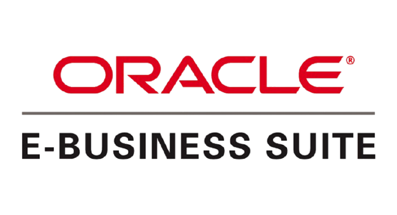

# Oracle E-Business Suite (EBS): AI Add-On 

  

## 1. Enterprise Challenges (Real, Commonly Reported)

- **Open Interface load validation** - AP/GL/AR Open Interface tables catch structural errors but not business-context issues in account combinations or supplier data.
- **AP exception handling** - Duplicate and near-duplicate invoice submissions create manual matching work, especially across operating units.
- **Supplier onboarding document intake** - iSupplier registration documents and compliance forms often require manual review and data entry.
- **Concurrent program and interface monitoring** - Failed concurrent requests and interface errors require active monitoring, particularly in multi-org environments.
- **Flexfield and supplier master data quality** - Inconsistent descriptive flexfield usage and duplicate supplier records persist in long-running EBS instances.
- **Functional knowledge gaps** - Many EBS instances run heavily customized configurations where institutional knowledge of Forms personalizations and workflow rules is concentrated in a few people.

## 2. Native Limitations (Why the Gap Exists)

Oracle E-Business Suite provides a mature, well-documented integration foundation - Open Interfaces, PL/SQL APIs, WebADI, Concurrent Programs, and increasingly Oracle Integration Cloud (OIC) for modern connectivity. However:

- **Open Interface tables validate structure and required fields, not business-context accuracy** - a load can pass interface validation and still contain an incorrect account combination.
- **Base AP matching is largely exact-match on invoice number/supplier/amount**, and doesn't reliably catch near-duplicates from resubmitted or reformatted invoices.
- **Document intelligence for unstructured supplier documents isn't a core EBS capability** - iSupplier handles structured registration data but not free-form document extraction.
- **In-app functional guidance is limited**, particularly in instances with extensive Forms personalizations that diverge from standard Oracle documentation.

These reflect EBS's architecture as a mature, highly customized platform where Open Interfaces and PL/SQL APIs are the intended, supported extension surface - deliberately separated from core Forms and workflow logic to preserve patching and upgrade compatibility.

## 3. Why Organizations Still Struggle

Many EBS instances are 10-20+ years into their lifecycle with significant Forms personalization and custom PL/SQL layered on top. Adding new intelligence directly into that layer increases patching risk, so most organizations default to manual review rather than deepen the customization footprint.

## 4. How the AI Add-On Complements Oracle EBS (Non-Invasive by Design)

| Challenge | AI Add-On | Integration Method |
|---|---|---|
| Open Interface load validation | Intelligent Data Migration Validation Agent | PL/SQL API/Open Interface reads pre- and post-load; zero core changes |
| Duplicate/exception invoices | Semantic Duplicate Invoice Detection | Reads via AP Open Interface/PL/SQL APIs |
| Supplier document intake | Vendor Invoice Intelligence + AI OCR Engine | File-based/API integration, complements iSupplier |
| Flexfield/supplier data quality | Financial Data Quality Agent | Batch validation via PL/SQL APIs |
| Functional support | AI Knowledge Assistant | External service, no Forms personalization dependency |
| Interface/concurrent monitoring | ERP Integration AI Gateway | Monitors OIC/interface endpoints externally |

All components integrate through EBS's standard Open Interfaces, PL/SQL APIs, and Oracle Integration Cloud - no Forms personalization or core workflow modification, fully compatible with Oracle patching cycles.

---

## 5. LinkedIn Content - Six Versions

### A. Short LinkedIn Post (250 words)

Anyone who has supported a mature Oracle E-Business Suite environment knows the pattern: Open Interface loads that pass validation but still need account combination cleanup, AP exception queues full of near-duplicate invoices, and supplier documents that need manual review before iSupplier registration completes.

This isn't a shortcoming in EBS's design. Open Interfaces and PL/SQL APIs are the intended, supported extension surface - deliberately kept separate from core Forms and workflow logic to preserve patching compatibility. The friction shows up in the layer around those interfaces: business-context validation, semantic duplicate detection, and document intelligence.

That's the layer we've built for. Our AI add-ons - a Data Migration Validation Agent, Semantic Duplicate Invoice Detection, and Vendor Invoice Intelligence - connect entirely through Open Interfaces, PL/SQL APIs, and Oracle Integration Cloud. No Forms personalization, no added patching risk.

The goal is to reduce the manual validation and exception-handling effort your AP and finance teams absorb every cycle, without deepening the customization footprint that makes future patching harder.

For EBS architects and finance ops leaders: how is your organization currently handling AP duplicate detection and Open Interface pre-load validation in a long-running instance?

#OracleEBS #EBusinessSuite #OracleIntegrationCloud #AIinFinance #EnterpriseArchitecture

---

### B. Long LinkedIn Article

**Title: Extending Oracle E-Business Suite Without Deepening Your Customization Footprint**

Oracle E-Business Suite instances are often among the most deeply customized ERP deployments in an enterprise - many have run for 15-20+ years, accumulating Forms personalizations, custom PL/SQL, and workflow modifications along the way. That maturity is a strength, but it also raises the stakes for any new customization: every touchpoint added to the core increases patching risk and testing overhead.

Having worked across EBS, S/4HANA, and cloud-native ERP platforms, I've found EBS's Open Interface and PL/SQL API architecture to be a genuinely solid, well-documented extension surface - the discipline is in using it instead of reaching into Forms or workflow customization for problems that don't require it.

**The recurring patterns**

- **Open Interface loads pass structural validation and still require cleanup.** Required-field checks don't catch an account combination that's technically valid but contextually wrong.
- **AP exception queues fill with near-duplicate invoices.** Exact-match checks on invoice number/supplier/amount miss resubmitted or reformatted invoices, especially across operating units.
- **Supplier onboarding documents require manual review.** iSupplier handles structured registration well, but free-form compliance documents typically still need manual data entry.

None of this reflects an EBS shortcoming - it reflects a mature platform where the supported extension surface (Open Interfaces, PL/SQL APIs, OIC) is intentionally kept separate from core Forms and workflow logic.

**Where AI add-ons fit**

- **Data Migration Validation Agent** - validates Open Interface output against business-context rules using PL/SQL API reads.
- **Semantic Duplicate Invoice Detection** - applies similarity-based matching across AP data pulled via Open Interface/PL/SQL APIs.
- **Vendor Invoice Intelligence / AI OCR Engine** - extracts and structures supplier document data, complementing iSupplier.
- **Financial Data Quality Agent** - validates flexfield and supplier master data continuously via PL/SQL APIs.
- **AI Knowledge Assistant** - external service giving functional teams contextual guidance without touching Forms personalizations.

Every add-on works entirely through Oracle's supported interfaces - zero Forms personalization, zero core workflow modification, no added patching risk.

**The architectural principle**

In a platform where every customization carries a long-term maintenance cost, the right approach is to stay entirely on the supported interface layer. That's the discipline we've held ourselves to.

I'd like to hear from other EBS architects: how are you currently weighing new automation requests against patching and testing overhead in a mature instance?

#OracleEBS #EBusinessSuite #OracleIntegrationCloud #EnterpriseIntegration #AIAutomation

---

### C. Technical Discussion Version

**Headline: Business-Context Validation and Duplicate Detection for Oracle EBS - Zero Forms/Workflow Footprint**

A recurring technical challenge on EBS: Open Interface tables validate structure and required fields but not business-context accuracy, and base AP matching is largely exact-match.

Our architecture:

- **Read layer:** PL/SQL API and Open Interface reads against standard EBS data (AP invoices, GL account combinations, supplier master) across operating units.
- **Processing layer:** External AI/ML service performs semantic validation, embedding-based duplicate scoring, and document extraction for unstructured supplier documents.
- **Write-back layer:** Corrected data submitted via PL/SQL APIs or staged for Open Interface load.
- **Deployment:** Integrated via Oracle Integration Cloud or direct PL/SQL API calls - zero Forms personalization, zero custom workflow additions, no impact on Oracle patching cycles.

For duplicate detection, we use embedding-based similarity across invoice line text and supplier identifiers, normalized across operating units, to catch near-duplicates that exact-match configuration misses.

Curious how other EBS architects are handling this today - custom PL/SQL packages, or an external service pattern that avoids Forms/workflow touchpoints?

#OracleEBS #PLSQL #OracleIntegrationCloud #AIEngineering

---

### D. Executive Version

**Headline: Reducing Manual Finance Effort on Oracle EBS - Without Deepening Customization Risk**

Organizations running Oracle E-Business Suite have often invested in the platform for well over a decade. What's frequently underestimated is the manual effort still absorbed around it - validating interface loads, chasing duplicate invoices, and reviewing supplier documents by hand - and the patching risk that comes with closing these gaps through deeper core customization.

Our AI add-ons reduce that manual burden by connecting entirely through Open Interfaces, PL/SQL APIs, and Oracle Integration Cloud - no Forms personalization, no added patching risk. The result: faster invoice processing, fewer duplicate payments, and improved data quality.

For finance and IT leaders: where is manual effort most concentrated in your EBS operations today?

#OracleEBS #FinanceTransformation #AIinERP #OracleIntegrationCloud

---

### E. CIO Version

**Headline: Extending Oracle EBS Value Without Increasing Patching Risk**

For CIOs managing mature EBS instances, every customization decision carries testing and patching overhead. Our AI add-ons - covering data migration validation, invoice intelligence, and data quality - are built entirely through Open Interfaces, PL/SQL APIs, and Oracle Integration Cloud, adding zero footprint to Forms or workflow customization.

For CIOs: how does your organization currently weigh new automation requests against patching and regression testing overhead?

#OracleEBS #CIO #OracleIntegrationCloud #ITGovernance

---

### F. Enterprise Architect Version

**Headline: An Architecture-Safe Pattern for AI Augmentation on Oracle E-Business Suite**

The governing question for any EBS extension: does it add to the Forms/workflow customization footprint, or does it stay entirely within Open Interfaces, PL/SQL APIs, and OIC?

Our AI add-on suite is architected strictly around the latter - zero Forms personalizations, zero custom workflow objects, full compatibility with Oracle's patching cycles.

Curious how other EBS architects are governing new integration approvals in mature instances - a formal CAB process, or a lighter review?

#OracleEBS #EnterpriseArchitecture #OracleIntegrationCloud #AIAugmentation

---

## 6. Supporting Assets

**Hashtags (general pool):**
#OracleEBS #EBusinessSuite #OracleIntegrationCloud #PLSQL #iSupplier #AIinFinance #EnterpriseArchitecture #FinanceTransformation #ITGovernance

**Suggested Hero Image Ideas:**
- Architecture diagram: EBS core (Forms/workflow, untouched) with AI add-ons connecting via PL/SQL API/OIC arrows.
- Split-panel: "Manual AP Exception Review" vs. "AI-Assisted Duplicate Detection" dashboard.
- Abstract integration-gateway visual in neutral red/gray tones (avoid Oracle's actual logo/trademark).

**Call to Action (choose per version):**
- "Comment with how your team weighs new automation against patching risk."
- "Message me for a walkthrough of the PL/SQL API–based architecture."
- "Follow for more on zero-footprint AI extension patterns for Oracle EBS."
