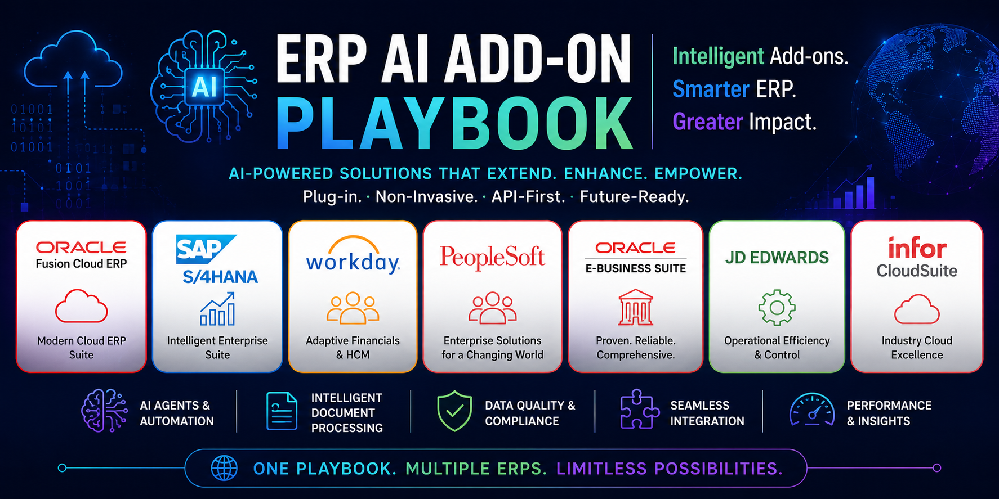

# ERP-Specific AI Add-On 

  

A collection of ERP-specific LinkedIn content packages designed to introduce AI add-on solutions to enterprise ERP communities - respecting each platform's native architecture, terminology, and extensibility model.

Each package includes: real enterprise challenges, native platform limitations, an AI add-on integration mapping, and **6 content versions** (Short Post, Long Article, Technical Discussion, Executive, CIO, and Enterprise Architect versions), plus hashtags, hero image ideas, and calls to action.

---

## Contents

| ERP Platform | Description | Document |
|---|---|---|
| **Oracle Fusion Cloud ERP** | Covers FBDI/HDL pre-load validation, semantic duplicate invoice detection, and vendor document intelligence - positioned around Fusion's REST APIs, FBDI/HDL, and Business Events. | [Oracle_Fusion.md](./Oracle_Fusion.md) |
| **SAP S/4HANA** | Covers LTMC/LSMW migration validation, MIRO invoice exception handling, and vendor document intake - framed around SAP's "clean core" principle, BTP side-by-side extensibility, BAPIs, IDocs, and OData. | [SAP_S4HANA.md](./SAP_S4HANA.md) |
| **Microsoft Dynamics 365 Finance & Supply Chain** | Covers Data Management Framework (DMF) import validation, cross-entity duplicate invoice detection, and vendor onboarding documents - built around OData, DMF, Business Events, and the Power Platform. | [Dynamics365.md](./Dynamics365.md) |
| **Workday Financial Management** | Covers EIB pre-load validation, Spend Management duplicate invoice detection, and supplier document intake - integrated through Workday REST/SOAP APIs, EIB, and Workday Extend. | [Workday.md](./Workday.md) |
| **PeopleSoft FSCM** | Covers File Layout/Component Interface load validation, AP voucher duplicate detection, and vendor document intake - designed for zero PeopleCode footprint via Component Interfaces, Integration Broker, and EIPs, preserving PUM upgrade safety. | [PeopleSoft_FSCM.md](./PeopleSoft_FSCM.md) |
| **Oracle E-Business Suite (EBS)** | Covers Open Interface load validation, AP duplicate invoice detection, and iSupplier document intake - built on Open Interfaces, PL/SQL APIs, and Oracle Integration Cloud, avoiding Forms personalization and patching risk. | [Oracle_EBS.md](./Oracle_EBS.md) |
| **JD Edwards EnterpriseOne** | Covers Z-table/batch load validation, AP voucher duplicate detection, and vendor document intake - integrated via the Orchestrator Studio and AIS Server REST APIs, avoiding custom C Business Functions and ESU risk. | [JD_Edwards.md](./JD_Edwards.md) |
| **Infor CloudSuite** | Covers ION-based data load validation, AP duplicate invoice detection, and supplier document intake - architected as ION-connected services within Infor OS, keeping CloudSuite modules loosely coupled and upgrade-safe. | [Infor_CloudSuite.md](./Infor_CloudSuite.md) |

---

## Structure of Each Package

Every document follows the same format:

1. **Enterprise Challenges** : real, commonly reported operational pain points for that ERP
2. **Native Limitations** : capabilities not delivered out-of-the-box, and why (architectural rationale, not criticism)
3. **Why Organizations Still Struggle** : the practical cost of closing these gaps today
4. **AI Add-On Mapping** : a table showing which add-on solves which challenge, and via which non-invasive integration method (REST APIs, standard interfaces, business events, file-based integration, etc.)
5. **Six LinkedIn Content Versions:**
   - **A.** Short LinkedIn Post (~250 words)
   - **B.** Long LinkedIn Article
   - **C.** Technical Discussion Version (architect/developer audience)
   - **D.** Executive Version
   - **E.** CIO Version
   - **F.** Enterprise Architect Version
6. **Supporting Assets** - hashtag pool, hero image concepts, and calls to action

---

## Positioning Principles Used Throughout

- No ERP is ever criticized or described as missing fundamental functionality
- No cross-ERP comparisons
- Every AI add-on is positioned as a **non-invasive, API-driven, architecture-safe extension** - never a core modification
- Tone is professional, enterprise, and architect-to-architect - no sales hype
- Each post closes with a genuine discussion prompt for the community
